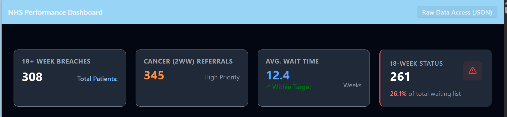
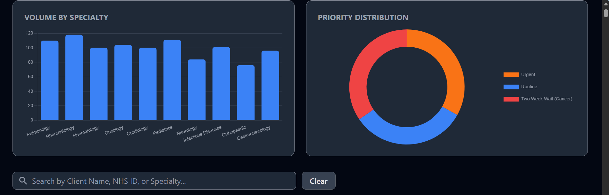
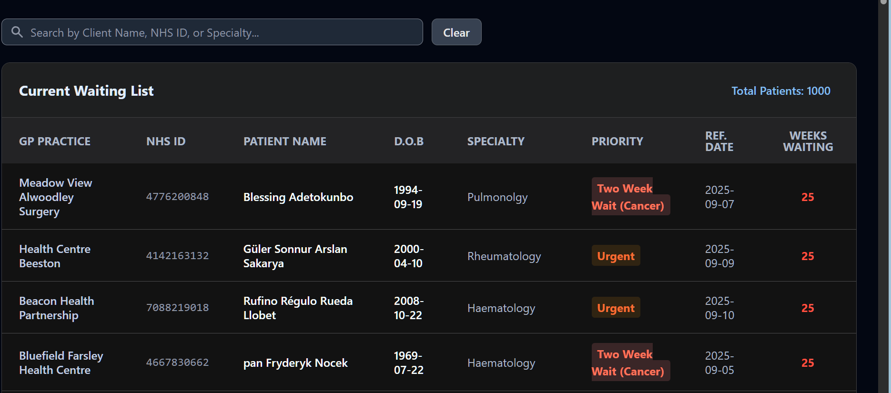
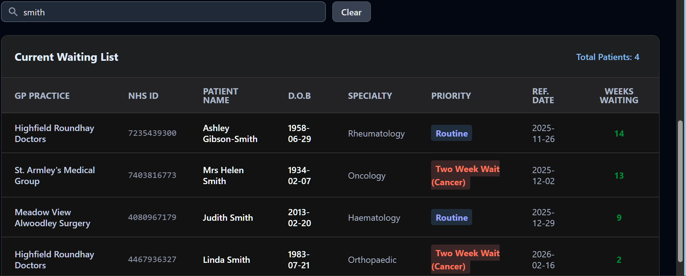

# 🚀 NHS Performance Dashboard V1


---

An end-to-end Clinical Intelligence suite that monitors patient wait times and predicts RTT (Referral to Treatment) breaches using a high-performance DuckDB analytical engine. This project features a full modular pipeline: synthetic patient generation with Faker and nhs-number validation, high-speed data processing via Polars and Pandas, and a FastAPI-powered dashboard with real-time waitlist metrics and specialty distribution charts

---

<details>
  <summary>📸 Screenshots</summary>






</details>

---

# 🛠️ Setup Instructions

### Clone the Repository
```bash
git clone https://github.com/reory/nhs-performance-dashboard.git
cd nhs-performance-dashboard
```
### 1. Create a Virtual Environment
```bash
python -m venv venv
source venv/Scripts/activate # On mac/linux venv/bin/activate
```
### 2. Install Dependencies
```bash
pip install -r requirements.txt
```
### Initialize the Data Engine
```bash
python generate_faker_data.py
```
### Launch the Dashboard
Run the Uvicorn server to host the FastAPI application.
```bash
uvicorn app.main:app --reload
```
Navigate to http://127.0.0.1:8000 to view the live clinical suite.

---
<details>
  <summary>📂 Project Structure</summary>

```text
nhs_performance_dashboard/
├── app/
│   ├── main.py
│   ├── database.py
│   ├── models.py
│   ├── routers/
│   │   ├── api.py
│   │   └── dashboard.py
│   └── templates/
|       ├── html_components/
|       |    └── charts.html
|       |    ├── metrics.html
│       |    ├── navbar.html
│       |    ├── search_bar.html
│       |    ├── table.html
|       ├── js_components/
|       |    └── charts_logic.html
|       |    ├── js_scripts.html
│       |    ├── metrics.html
│       |    ├── search_logic.html
│       ├── base.html
|       ├── index.html
├── data/
│   └── hospital_data.db
├── scripts/
│   └── generate_faker_data.py
|   └── view_all.py
├── tests/
|   └── conftest.py
|   └── test_clinical_logic.py
|   └── test_connection.py
|   └── test_validation.py
├── .venv
├── requirements.txt
├── README.md
├── CONTRIBUTING.md
├── LICENCE.md
├── pytest.ini
```

</details>

---

# 💻 Tech Stack

* **Framework:** [FastAPI](https://fastapi.tiangolo.com/) (High-performance Python API)
* **Database:** [DuckDB](https://duckdb.org/) (In-process analytical database)
* **Validation:** [Pydantic](https://docs.pydantic.dev/) & [nhs-number](https://pypi.orgproject/nhs-number/)
* **Testing:** [Pytest](https://docs.pytest.org/) (Unit and Logic testing)
* **Frontend:** Jinja2 Templates, HTML5, CSS3 (NHS Frontend Framework styles)

---

# 🧪 Testing

Consistent with my professional workflow in the West Yorkshire Traffic Intelligence Suite,and other projects, this project includes a full Pytest suite to ensure RTT breach calculations and search logic remain modular and predictable.
```bash
pytest
```

---

# 🤝 Contributing

- Contributions are welcome! If you have ideas to improve the nhs performance dashboard UI or logic:

- Fork the Project.

- Create your Feature Branch (git checkout -b feature/AmazingFeature).

- Commit your Changes (git commit -m 'Add some AmazingFeature').

- Push to the Branch (git push origin feature/AmazingFeature).

- Open a Pull Request.

---

<details>
  <summary>📝 Notes</summary>

- Data Privacy: This project uses synthetic data generated by Faker. No real patient data is included or required to run the demo.

- Hybrid Data Strategy: Much like my Word Counter Vault project , this dashboard utilizes DuckDB for high-performance (Analytical) queries while using FastAPI for low-latency web responses. This ensures that complex RTT breach calculations don't block the main application thread

- Modular Component Architecture: To ensure scalability and maintainability, the UI is architected into standalone html_components and js_components. This allows for a "plug-and-play" development cycle where individual dashboard metrics can be updated without refactoring the entire core layout.

- Automated Validation & Testing: The system includes a full Pytest suite and nhs-number checksum validation to ensure clinical data integrity—mirroring the "modular and predictable" package standards implemented in my previous projects.

</details>

---

<details>
<summary>🗺️ Roadmap</summary>

- [ ] Email Alerts: Auto-notify admins when a patient is nearing the 18 week threshold.

- [ ] Predictive Analytics (ML Forecasting)
Implement an XGBoost or Scikit-Learn model to predict potential breach "hotspots" based on historical specialty volume and seasonal trends, similar to the logic used in my Invoicing Fraud Detector.

- [ ] Geospatial Regional Mapping
Integrate a Folium/Leaflet map component to visualize patient distribution across West Yorkshire, allowing trust managers to identify geographical barriers to care access.

</details>

---

<details>
  <summary>❤️ Thanks</summary>

**Faker** - For helping create the fake data.
The NHS Digital Community: For maintaining the open standards and logic found in the nhs-number validation libraries.
The **FastAPI & NiceGUI** Teams: For creating high-performance frameworks that make complex clinical dashboards possible with Python.
The Open Source Community: For the Faker and **DuckDB** projects, which allow developers to build and test robust systems without compromising real-world patient privacy.

</details>

---

**Built By Roy Peters** [Click here for contact details😁](https://www.linkedin.com/in/roy-p-74980b382/)